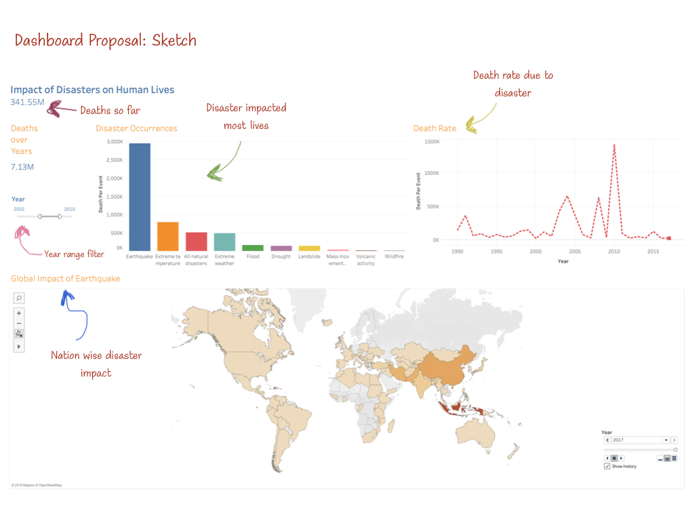

# Natural Disasters And Their Impact Across The World
 

Suppose, Bob is working for an international humanitarian organization. He is trying to see where to allocate funds for earthquake diaster relief. He wants to explore historical data of how earthquakes affected different countries. This helps him to decide which countries are most effected by earthquakes every year. While using our Dash app, he noticed that in terms of absolute deaths per year due to earthquakes, China and India appeared to be highest every single year. However, while exploring the percentage that eqarthquakes contribute to the annual death rate, he discovered that Haiti was the highest due to the small population of the country. He also discovered that earthquakes have had an increasing impact on the country in recent years. From this data, Bob was able to make the informed decision that it is best to provide monetary support to Haiti instead. Due to the insightfulness of this Dash application, Bob nominated it to be the "App of the Year". Many people started using this app to grow insight of how earthquakes effect different regions in the world. The app ends up getting improved and wins a Nobel Prize. Please read our full proposal [here](https://github.com/UBC-MDS/DSCI_532_group_201_milestone_1/blob/master/proposal.md).

## Sketch
<html>
  
<html>
